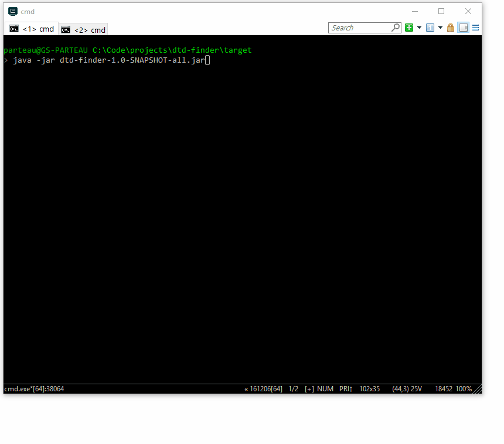

# DTD Finder [](https://travis-ci.org/GoSecure/dtd-finder)

Identify DTDs on filesystem snapshot and build XXE payloads using those local DTDs.

Quick links:

 - [Get the complete files list and XXE Payloads](https://github.com/GoSecure/dtd-finder/tree/master/list)
 - For more information, [read the detailed blog post](https://www.gosecure.net/blog/2019/07/16/automating-local-dtd-discovery-for-xxe-exploitation/)

## Building the tool

```
$ mvn install
```

## Usage with docker image

1. Start/Build the docker image
```
$ docker run ...
```

2. Export the filesystem
```
$ docker export weblogic12 -o weblogic-12-dev.tar
```

3. Launch dtd-finder
```
$ java -jar dtd-finder-1.0-SNAPSHOT-all.jar weblogic-12-dev.tar

...
 [=] Found a DTD: /u01/oracle/wlserver/server/lib/consoleapp/webapp/WEB-INF/struts-config_1_2.dtd
Testing 9 entities : [%AttributeName, %BeanName, %Boolean, %ClassName, %Integer, %Location, %PropName, %RequestPath, %RequestScope]
 [+] The entity %AttributeName is injectable
 [+] The entity %BeanName is injectable
 [+] The entity %Boolean is injectable
 [+] The entity %ClassName is injectable
 [+] The entity %Integer is injectable
 [+] The entity %Location is injectable
 [+] The entity %PropName is injectable
 [+] The entity %RequestPath is injectable
 [+] The entity %RequestScope is injectable
...

The CLI tool can be launch against tar files and directories.

```
$ java -jar dtd-finder-1.0-SNAPSHOT-all.jar /specific/path/with/dtds
...
```


Report written to weblogic-12-dev.tar-dtd-report.md
```

## Demonstration



